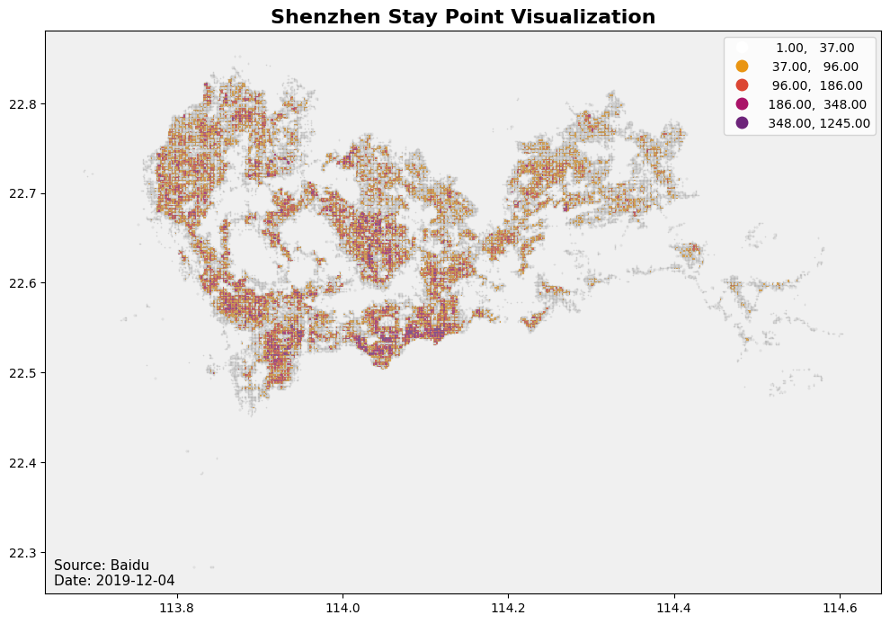
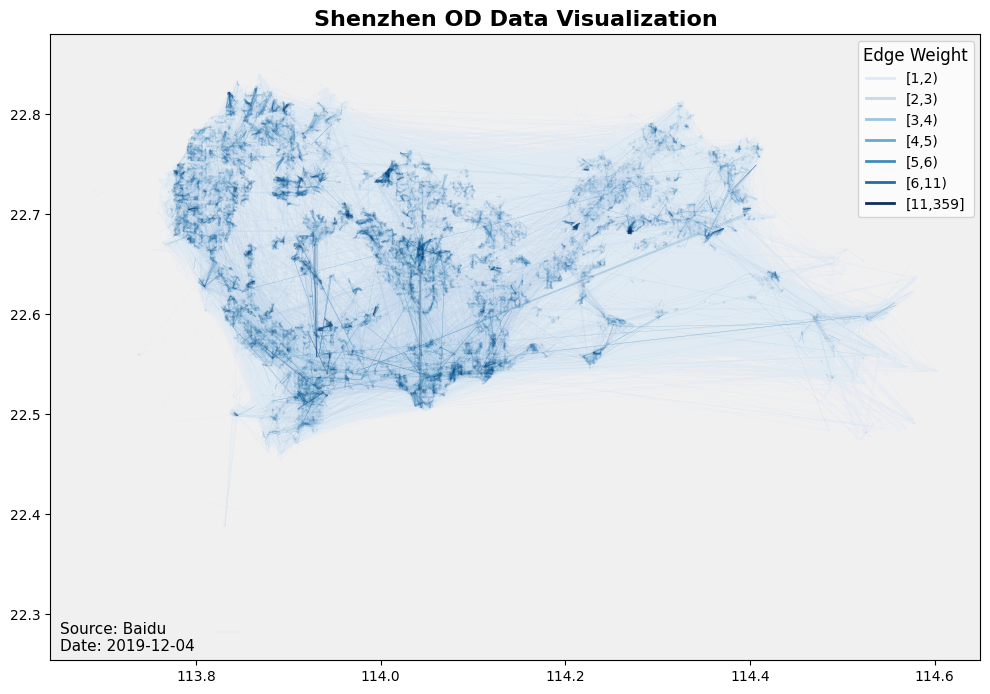
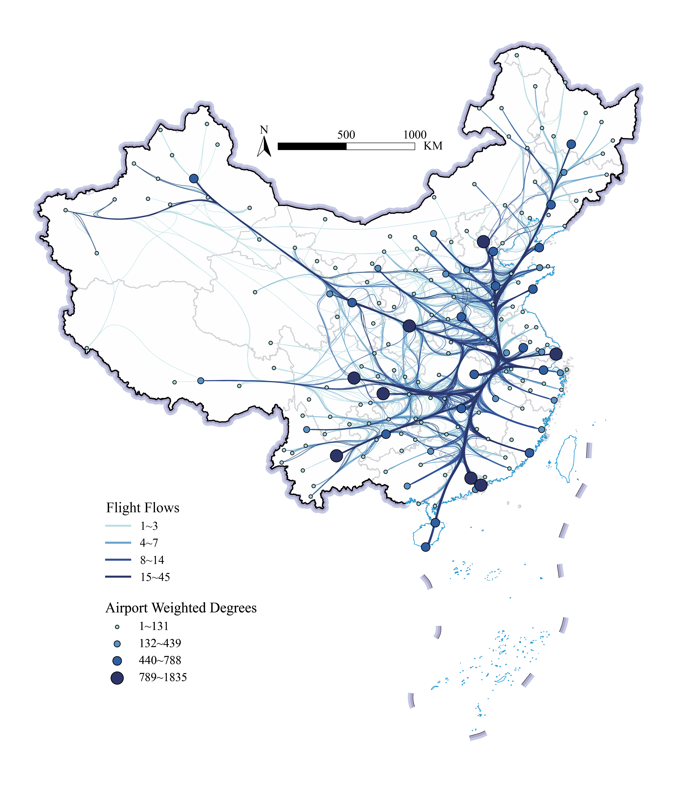
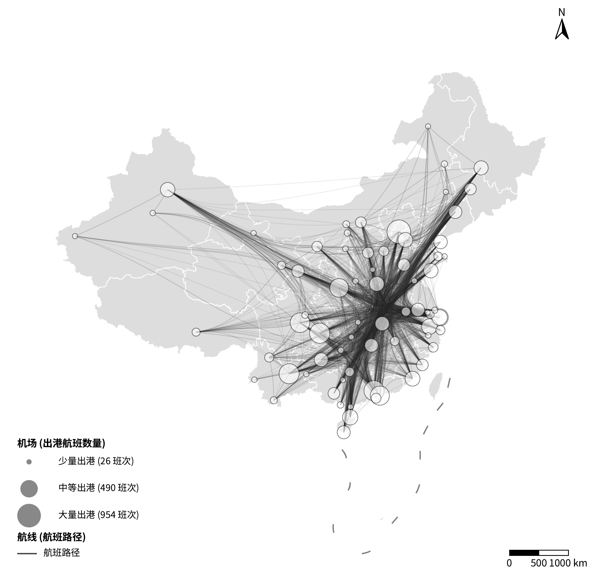
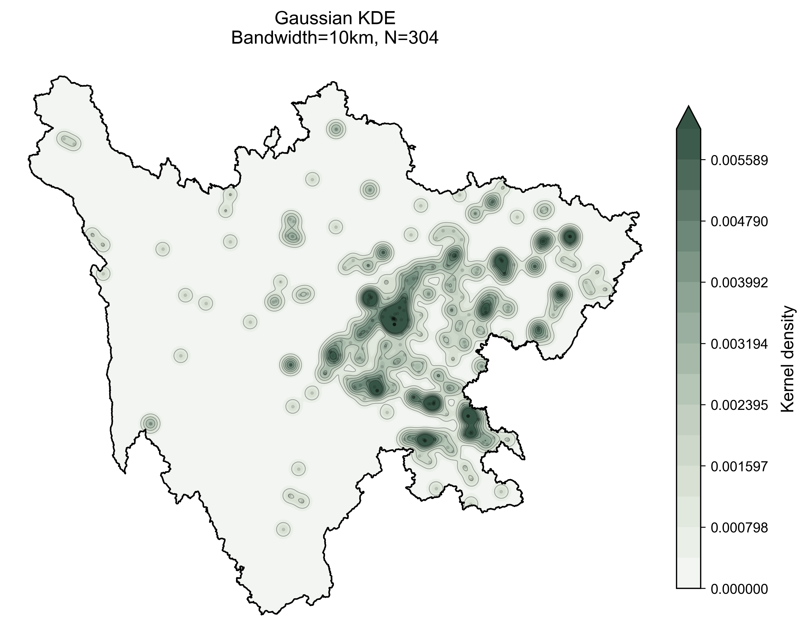
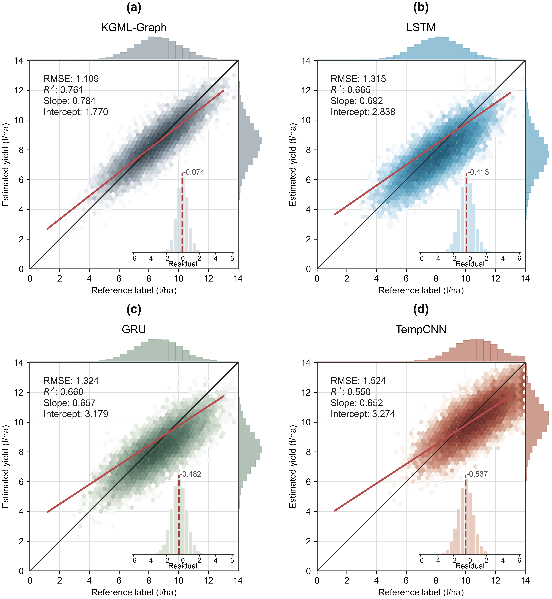

# 日常学习

- 分享代码写作日常

# 案例

## 2025年主要城市地铁路线和人口分布

## GIS和生成式AI

## OD数据

## 城市功能区主题建模

## 从文本中提取地理信息

## 捆绑型OD流

## 全球洪涝事件空间分布

## 栅格数据处理

## 中国航线

## 全球发电站分

## 全国洪涝事件分布

## NS正刊的标题情感分析

## 广州市微博签到可视化

## 全国2025年建成区和人口分布

## 空间核密度分析

## 密度散点图评估模型预测性能

